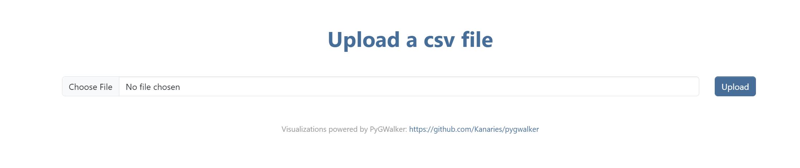
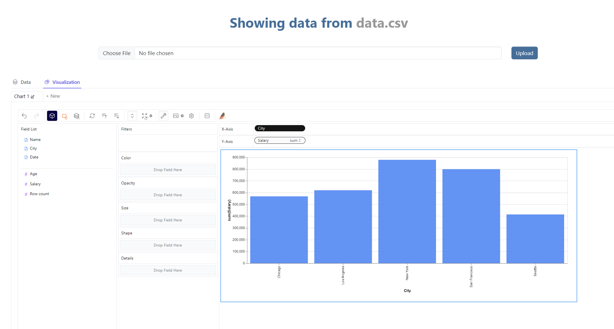

# Features

## PygWalkerView

The PygWalkerView view renders a page containing PyGWalker html. This view takes a queryset parameter and includes all data in the queryset for visualizations. By default fields defined in the model will be included. To exclude fields or include additional fields (such as related fields), use the field_list parameter to specify exact fields desired for visualizations.  

A Bootstrap 5 template is included, but can be overwritten using the template_name parameter. 

### Parameters
- **field_list:** list of model fields to include (defaults to fields defined in the model)
- **queryset:** queryset providing data available to visualization
- **theme:** PyGWalker theme to use for pyg html (defaults to "media")
- **title:** title used on html render
- **template_name:** template used when rendering page; (defaults to pygwalker/bs5/pygwalker.html)

### Usage Examples

```python
from djangoaddicts.pygwalker.views import PygWalkerView

class MyPygWalkerView(PygWalkerView):
    queryset = MyModel.objects.all()
```

##### Explicitly Defined Fields

```python
from djangoaddicts.pygwalker.views import PygWalkerView

class MyPygWalkerView(PygWalkerView):
    queryset = MyModel.objects.all()
    title = "MyModel Data Analysis"
    theme = "light"
    field_list = ["name", "some_field", "some_other__related_field", "id", "created_at", "updated_at"]
```


##### Custom Template
Custom views/templates can be used to override the Bootstrap 5 templates provided. Here is an example:

```python
from djangoaddicts.pygwalker.views import PygWalkerView

class MyPygWalkerView(PygWalkerView):
    queryset = MyModel.objects.all()
    template_name = "my_custom_template.html"
```


<br>

## StaticCsvPygWalkerView

The StaticCsvPygWalkerView view renders a page containing PyGWalker html with data sourced from a static csv file. 

A Bootstrap 5 template is included, but can be overwritten using the template_name parameter. 

### Parameters
- **csv_file:** csv file containing data to visualize
- **theme:** PyGWalker theme to use for pyg html (defaults to "media")
- **title:** title used on html render
- **template_name:** template used when rendering page; (defaults to pygwalker/bs5/pygwalker.html)


### Usage Examples

```python
from djangoaddicts.pygwalker.views import StaticCsvPygWalkerView

class MyPygWalkerView(StaticCsvPygWalkerView):
    csv_file = "my_csv_file.csv
```

##### Custom Template
Custom views/templates can be used to override the Bootstrap 5 templates provided. Here is an example:

```python
from djangoaddicts.pygwalker.views import StaticCsvPygWalkerView

class MyPygWalkerView(StaticCsvPygWalkerView):
    csv_file = "my_csv_file.csv
    template_name = "my_custom_template.html"
```


<br/>

## DynamicCsvPygWalkerView

The DynamicCsvPygWalkerView view is page that allows users to upload a csv file and creates the PyGWalker interface based on data in the uploaded csv file. To use this view, add the following to your INSTALLED_APPS in settings.py:

```python 
djangoaddicts.pygwalker
```
and add the following to your project-level urls.py:

```python
path("pygwalker/", include("djangoaddicts.pygwalker.urls"), ),
``` 

The page can be reached using a link such as:

```python
<a href="">my link</a>
```

### Page Examples

#### Initial Page


#### Rendered Visualization



<br/>

## GenericPygWalkerView

The GenericPygWalkerView creates a PyGWalker visualization interface from a provided app and model passed as kwargs. If query parameters are present, it includes only filtered data, based on query parameters, in the PyGWalker interface. To use this view, add the following to your INSTALLED_APPS in settings.py:

```python 
djangoaddicts.pygwalker
```
and add the following to your project-level urls.py:

```python
path("generic_pyg/<str:app_name>/<str:model_name>/", GenericPygWalkerView.as_view(), name="generic_pyg"),
``` 

The page can be reached using a link such as:

```python
<a href="/pygwalker/generic_pyg/my_app/my_model">my pygwalker link</a>
```


<br/>

## PygWalkerListView

The PygWalkerListView is a list view that extends the HandyHelperListView (from handyhelpers) to add an icon for a PyGWalker visualzation interface. If the list view is filtered, include only filtered data in the PyGWalker interface.

A Bootstrap 5 template is included, but can be overwritten using the template_name parameter. 

### Usage Examples

```python
from djangoaddicts.pygwalker.views import PygWalkerListView

class ListProducts(PygWalkerListView):
    """list available MyModel entries"""
    queryset = MyModel.objects.all()
    title = "MyModel Entries"
    table = "myapp/table/mymodels.htm"
```


<br/>

## PygWalkerPaginatedListView

The PygWalkerPaginatedListView is a list view that extends the HandyHelperPaginatedListView (from handyhelpers) to add an icon for a PyGWalker visualzation interface. If the list view is filtered, include only filtered data in the PyGWalker interface.

A Bootstrap 5 template is included, but can be overwritten using the template_name parameter. 

### Usage Examples

```python
from djangoaddicts.pygwalker.views import PygWalkerPaginatedListView

class ListProducts(PygWalkerPaginatedListView):
    """list available MyModel entries"""
    queryset = MyModel.objects.all()
    title = "MyModel Entries"
    table = "myapp/table/mymodels.htm"
```

<br/>
